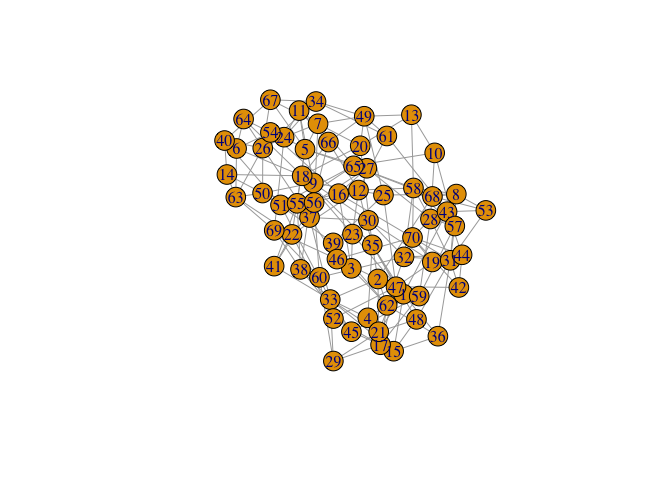
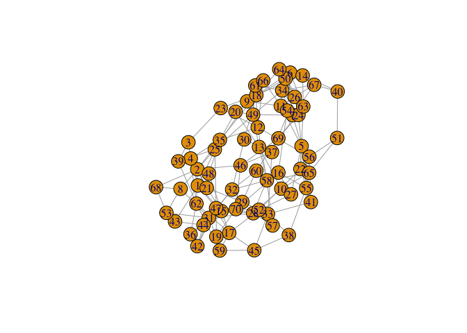
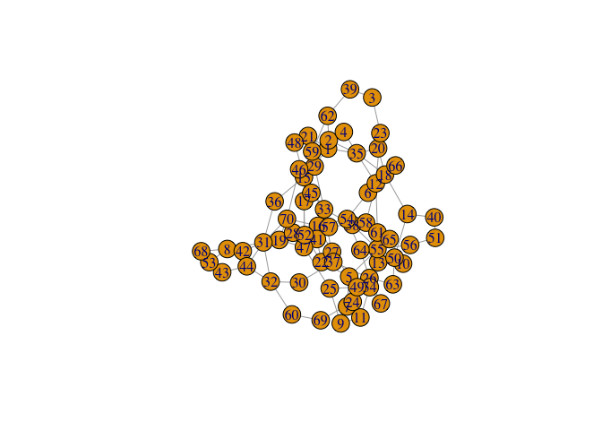
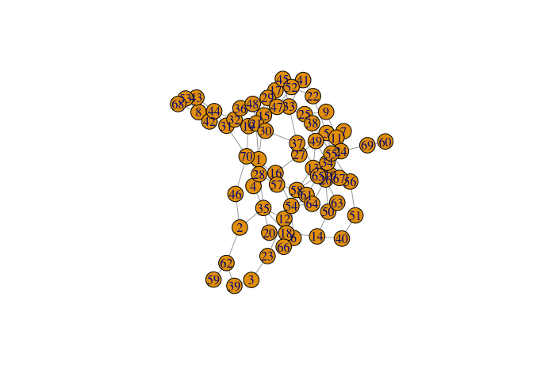
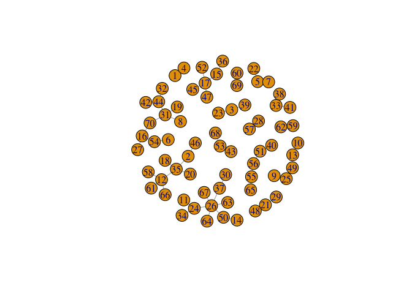

similarity analyses of mystery data
================
Jesper Bruun
3/31/2020

## Import data set

``` r
mydata<-read.csv("data/data_spring2019.csv",sep=";")
mydata
```

    ##    Q1 Q2 Q3 Q4 Q5 Q6 Q7 Q8 Q9 Q10 Q11 Q12 Q13 Q14 Q15 Q16 Q17 Q18 Q19 Q20 Q21
    ## 1   4  4  1  5  4  5  4  2  4   4   4   2   4   4   2   5   4   5   4   2   4
    ## 2   4  4  5  2  2  5  4  4  5   5   5   3   4   4   5   1   2   2   2   4   4
    ## 3   2  4  1  1  2  5  3  5  5   4   3   2   2   4   1   1   2   4   2   5   5
    ## 4   4  1  1  5  2  5  4  2  1   5   5   4   4   4   2   4   5   5   3   2   2
    ## 5   1  4  5  5  1  5  1  1  5   4   2   4   1   5   1   5   2   5   1   5   5
    ## 6   1  4  5  1  1  4  2  4  2   4   1   2   5   2   5   5   2   2   2   5   2
    ## 7   1  5  5  5  4  5  1  5  2   2   2   2   1   5   1   5   2   5   1   5   4
    ## 8   4  2  2  5  2  4  1  4  3   1   4   4   4   2   1   5   5   4   2   1   3
    ## 9   2  3  2  5  5  5  2  1  4   4   5   1   1   4   1   4   4   5   1   1   5
    ## 10  1  2  4  5  4  3  4  5  4   5   5   2   5   5   5   4   1   3   5   5   3
    ## 11  1  5  2  4  5  5  1  5  5   4   2   1   5   5   2   4   5   5   1   5   5
    ## 12  1  5  1  5  2  2  1  4  2   4   2   1   1   4   2   4   2   1   1   4   1
    ## 13  3  5  2  5  5  3  1  3  4   1   5   2   1   5   2   5   3   3   1   4   3
    ## 14  5  4  3  5  1  1  3  4  1   1   4   1   4   5   4   5   1   3   4   5   1
    ## 15  1  4  2  2  2  2  4  2  4   4   5   4   2   2   1   4   4   5   4   4   4
    ## 16  5  5  4  5  2  2  4  5  5   4   4   1   5   4   4   5   2   4   1   5   2
    ## 17  1  4  2  2  2  2  2  4  4   4   3   2   2   2   2   2   2   2   1   4   4
    ## 18  5  4  1  1  4  4  4  4  1   1   5   2   4   5   2   5   2   5   2   4   1
    ## 19  5  2  5  4  2  4  2  5  4   2   3   2   2   4   4   5   4   4   2   4   2
    ## 20  5  5  2  5  4  4  2  3  2   1   2   2   4   4   2   5   2   5   3   4   2
    ## 21  4  5  5  2  2  4  2  2  4   4   4   4   2   4   4   4   2   5   2   2   4
    ## 22  1  4  1  5  2  3  2  5  5   4   2   4   4   5   5   4   4   2   4   4   1
    ## 23  1  4  1  5  4  5  1  4  1   1   4   2   2   4   1   4   4   4   1   4   1
    ## 24  1  5  1  5  5  5  1  5  5   1   1   1   1   5   1   5   5   5   1   5   5
    ## 25  1  5  2  5  1  4  1  1  4   4   4   4   1   4   2   5   4   4   1   1   4
    ## 26  1  1  1  5  1  1  1  5  5   1   1   1   1   1   1   5   1   1   1   2   5
    ## 27  1  5  4  5  2  5  2  5  1   4   2   1   5   2   1   5   2   5   4   2   3
    ## 28  2  2  4  4  2  3  2  4  4   4   2   2   2   2   4   4   2   3   4   4   4
    ## 29  1  1  2  1  2  4  2  2  4   4   3   2   1   1   4   1   5   5   1   3   1
    ## 30  5  4  5  1  5  4  1  5  1   5   3   4   4   2   5   5   4   1   3   2   4
    ## 31  2  2  4  5  2  4  2  4  4   2   4   2   4   2   4   5   4   4   2   4   4
    ## 32  2  5  4  5  1  4  1  5  1   5   2   2   2   5   4   5   4   4   4   5   4
    ## 33  1  4  4  1  2  2  2  2  4   5   5   4   1   4   2   2   2   2   1   2   4
    ## 34  5  5  2  4  1  1  1  5  5   2   1   1   1   5   1   5   5   5   1   4   5
    ## 35  4  4  1  5  2  5  2  4  2   4   5   4   4   4   2   5   2   5   2   4   4
    ## 36  2  4  2  5  2  2  4  1  4   4   1   1   4   2   2   5   5   4   4   5   4
    ## 37  5  4  5  2  1  1  2  4  4   5   2   5   1   1   5   2   1   1   1   2   4
    ## 38  2  4  1  1  4  5  2  5  4   4   5   1   1   4   5   2   5   5   1   2   4
    ## 39  1  4  4  1  1  1  4  1  5   4   4   2   2   4   3   1   1   2   4   1   5
    ## 40  4  1  3  5  2  1  3  5  4   3   4   4   2   5   4   1   1   1   3   4   3
    ## 41  1  4  1  1  4  2  1  5  2   5   4   5   1   5   4   3   1   2   1   4   2
    ## 42  2  4  2  4  4  4  2  4  4   2   2   4   4   4   3   5   5   4   2   2   5
    ## 43  4  2  4  4  4  2  1  5  2   2   4   1   4   4   2   4   2   4   1   5   4
    ## 44  4  4  4  5  4  4  1  5  4   2   4   2   4   1   4   5   2   4   2   5   4
    ## 45  1  5  1  2  4  2  2  1  4   2   4   2   1   4   1   2   2   2   1   2   4
    ## 46  4  2  2  2  2  2  5  4  3   5   2   1   4   4   5   2   4   5   1   2   4
    ## 47  1  4  2  4  2  4  2  4  4   4   4   2   2   4   2   5   4   3   2   4   4
    ## 48  2  2  4  2  2  5  2  2  2   2   4   4   2   4   4   4   2   5   2   2   4
    ## 49  5  5  1  5  5  4  1  5  2   2   4   2   1   5   2   5   5   4   1   4   4
    ## 50  5  3  1  5  1  1  1  1  5   1   5   1   5   5   4   5   1   1   1   1   5
    ## 51  1  5  4  5  4  5  3  5  4   3   3   4   1   4   3   5   2   2   3   4   4
    ## 52  1  4  3  5  2  2  2  3  4   4   2   2   2   4   3   4   2   4   1   4   5
    ## 53  4  2  5  4  3  4  4  4  2   2   4   1   4   2   5   4   2   4   4   4   3
    ## 54  5  5  3  4  5  2  2  5  5   5   1   2   5   1   1   5   1   4   2   5   2
    ## 55  2  4  4  5  4  3  1  5  5   4   5   1   1   5   4   5   2   2   1   5   5
    ## 56  2  5  4  5  2  2  1  5  1   2   3   1   1   5   5   5   2   2   1   4   1
    ## 57  2  4  4  2  4  3  2  4  4   4   2   2   4   4   4   2   2   3   2   4   3
    ## 58  1  5  4  5  2  4  1  4  3   4   2   2   1   5   4   5   2   3   1   4   3
    ## 59  2  2  4  2  4  2  2  3  4   3   4   2   2   4   2   2   2   4   4   4   3
    ## 60  5  5  1  5  1  5  5  5  1   5   5   1   1   5   5   1   4   5   1   5   1
    ## 61  2  5  2  4  4  4  1  4  2   2   1   1   1   4   2   5   1   1   1   4   4
    ## 62  2  4  3  2  4  2  4  4  5   5   4   2   2   3   2   1   2   4   4   4   4
    ## 63  1  1  1  1  1  1  3  5  5   1   4   4   5   2   5   4   4   5   4   5   5
    ## 64  4  1  5  5  4  2  2  5  5   1   1   2   5   4   4   5   1   5   2   4   1
    ## 65  1  5  5  5  4  1  1  5  3   4   5   4   2   5   5   5   2   2   2   5   5
    ## 66  5  5  1  4  1  2  4  4  2   4   2   5   2   5   2   4   4   4   1   4   4
    ## 67  1  1  4  3  2  1  1  5  5   3   2   1   1   2   1   5   2   1   1   4   4
    ## 68  4  2  5  3  3  2  3  4  3   4   5   3   3   2   2   3   4   2   2   2   3
    ## 69  1  5  1  2  1  5  3  5  5   5   5   1   1   1   1   2   4   5   1   5   5
    ## 70  1  2  2  4  2  2  2  4  4   4   4   2   4   5   4   5   2   4   1   4   2
    ##    Q22 Q23 Q24
    ## 1    4   4   4
    ## 2    5   2   4
    ## 3    2   4   2
    ## 4    3   4   4
    ## 5    5   1   1
    ## 6    1   1   1
    ## 7    1   4   1
    ## 8    4   1   2
    ## 9    2   4   2
    ## 10   1   1   4
    ## 11   1   4   1
    ## 12   4   2   2
    ## 13   1   5   2
    ## 14   4   5   1
    ## 15   4   5   4
    ## 16   2   1   2
    ## 17   4   4   2
    ## 18   1   1   1
    ## 19   4   2   2
    ## 20   4   4   2
    ## 21   5   4   4
    ## 22   5   1   5
    ## 23   2   4   2
    ## 24   1   1   1
    ## 25   4   5   2
    ## 26   1   1   1
    ## 27   2   1   3
    ## 28   2   2   2
    ## 29   5   3   3
    ## 30   4   4   1
    ## 31   1   2   2
    ## 32   5   4   2
    ## 33   5   5   4
    ## 34   5   4   2
    ## 35   4   2   2
    ## 36   5   2   1
    ## 37   5   1   2
    ## 38   4   5   1
    ## 39   4   4   2
    ## 40   1   3   1
    ## 41   5   3   5
    ## 42   2   4   2
    ## 43   4   4   4
    ## 44   2   2   2
    ## 45   4   4   2
    ## 46   2   2   5
    ## 47   4   4   4
    ## 48   4   5   5
    ## 49   4   5   2
    ## 50   1   5   1
    ## 51   4   3   4
    ## 52   5   1   4
    ## 53   4   4   2
    ## 54   4   1   1
    ## 55   2   5   1
    ## 56   2   3   1
    ## 57   4   2   3
    ## 58   4   2   2
    ## 59   2   4   2
    ## 60   5   5   3
    ## 61   1   2   2
    ## 62   5   4   2
    ## 63   1   5   1
    ## 64   1   1   2
    ## 65   4   2   4
    ## 66   1   1   1
    ## 67   5   4   1
    ## 68   4   4   3
    ## 69   4   5   5
    ## 70   2   2   2

## Load necesseary functions

``` r
library(igraph)
```

    ## 
    ## Attaching package: 'igraph'

    ## The following objects are masked from 'package:stats':
    ## 
    ##     decompose, spectrum

    ## The following object is masked from 'package:base':
    ## 
    ##     union

``` r
source("functions/backboneExtraction.r")
source("functions/segregation.r")
```

### Student similarity network

``` r
  #Function for calculating frequencies (here equated with probabilities) of responses
probs<-function(mydata,n){
  a<-as.numeric(names(table(mydata[,n])))
  p<-as.numeric(table(mydata[,n],useNA = "always")/length(mydata[,1]))
  x<-c(1:length(mydata[,1]))
  for(i in 1:length(a)){
    x[which(mydata[,n]==a[i])]<-p[i]
  }
  x[which(is.na(mydata[,n]))]<-p[6]
  return(x)
}

#Function which transforms frequencies/probabilities to information (bits)
pmat<-function(data){
pmat<-matrix(0,ncol=length(data),nrow=length(data[,1]))
for(j in 1:length(data)){
  pmat[,j]<-probs(data,j)  
  
}
infmat<--log2(pmat)
return(infmat)
}

  #Function for calculating similarities between respondents
  #The function uses Lin's (1998) information theoretical measure. 
simRes<-function(i,j,infmat,d){
  y<-infmat[i,]
  overlap<-sum(y[which(d[i,1:24]==d[j,1:24])])
  sinfi<-sum(infmat[i,1:24])
  sinfj<-sum(infmat[j,1:24])
  sim<-2*overlap/(sinfi+sinfj)
  return(sim)
}

  #Function for calculating similarity between k'th respondent and everyone else
simResk<-function(k,inf,d){
    simVec<-vector()
  for(i in 1:length(d[,1])){
    simVec[i]<-simRes(k,i,inf,d)
  }
  return(simVec)
}

  #Function for making similarity matrix. Really just a for-loop that uses simResk 
simMatrix<-function(d){
  inf<-pmat(d)
  similarityMatrix<-matrix(data=0,ncol=length(d[,1]),nrow=length(d[,1]))
  for(i in 1:length(d[,1])){
    similarityMatrix[,i]<-simResk(i,inf,d)  
    
  }
  return(similarityMatrix)
}
```

Now we use igraph to make the network

``` r
M<-simMatrix(mydata)
StudNet<-graph.adjacency(M,diag=F,weighted=T)
studid<-paste("S",c(1:length(mydata[,1])),sep="")
V(StudNet)$id<-studid
```

As expected, the network is close to fully connected, \(L=4804\),
\(L_{fc}=70*69=4830\). We use LANS (Foti et al 2011) to extract a
backbone network. The algorithm evalueates the links emanating from each
node and selects the ones above a certain threshold (below a certain
significance level). As a rule of thumb, we might say that we want a
connected network. So, we run the algorithm multiple times to find the
significance level (that is each node keeps only links that are
significant to the chosen level), which leaves us with a connected
network.

``` r
StudNetbb05<-backboneNetwork(StudNet,0.05,2)
plot(StudNetbb05)
```

<!-- -->

``` r
StudNetbb03<-backboneNetwork(StudNet,0.03,2)
plot(StudNetbb03)
```

<!-- -->

``` r
StudNetbb02<-backboneNetwork(StudNet,0.02,2)
plot(StudNetbb02)
```

<!-- -->

``` r
StudNetbb015<-backboneNetwork(StudNet,0.015,2)
plot(StudNetbb015)
```

<!-- -->

``` r
StudNetbb015<-backboneNetwork(StudNet,0.014,2)
plot(StudNetbb015)
```

<!-- -->

Now run community detection. I have been using infomap for a long time,
but the implementation in igraph is maybe not the best. We would
probably want a managable amount of communities with at enough people in
each group to do some kind of statistical analysis.

``` r
IM<-infomap.community(StudNetbb015)
IM
```

    ## IGRAPH clustering infomap, groups: 18, mod: 0.86
    ## + groups:
    ##   $`1`
    ##   [1] 14 26 30 37 50 63 64 67
    ##   
    ##   $`2`
    ##   [1]  8 19 31 32 42 44
    ##   
    ##   $`3`
    ##   [1] 15 17 36 45 47 52
    ##   
    ##   $`4`
    ##   + ... omitted several groups/vertices

``` r
table(IM$membership)
```

    ## 
    ##  1  2  3  4  5  6  7  8  9 10 11 12 13 14 15 16 17 18 
    ##  8  6  6  5  5  5  5  4  3  3  3  3  3  3  2  2  2  2

``` r
FG<-fastgreedy.community(StudNetbb015)
FG
```

    ## IGRAPH clustering fast greedy, groups: 15, mod: 0.88
    ## + groups:
    ##   $`1`
    ##    [1]  6  8 16 19 27 31 32 42 44 54 70
    ##   
    ##   $`2`
    ##    [1] 11 14 24 26 30 34 37 50 63 64 67
    ##   
    ##   $`3`
    ##   [1]  2 12 18 20 35 46 58 61 66
    ##   
    ##   $`4`
    ##   + ... omitted several groups/vertices

``` r
table(IM$membership)
```

    ## 
    ##  1  2  3  4  5  6  7  8  9 10 11 12 13 14 15 16 17 18 
    ##  8  6  6  5  5  5  5  4  3  3  3  3  3  3  2  2  2  2

Since FG and IM give the same modularity (Q) and FG has fewer modules,
for this example, we keep that. Now, we can analyse the answers of each
group. Here is a start:

``` r
mydata[FG$membership==1,]
```

    ##    Q1 Q2 Q3 Q4 Q5 Q6 Q7 Q8 Q9 Q10 Q11 Q12 Q13 Q14 Q15 Q16 Q17 Q18 Q19 Q20 Q21
    ## 6   1  4  5  1  1  4  2  4  2   4   1   2   5   2   5   5   2   2   2   5   2
    ## 8   4  2  2  5  2  4  1  4  3   1   4   4   4   2   1   5   5   4   2   1   3
    ## 16  5  5  4  5  2  2  4  5  5   4   4   1   5   4   4   5   2   4   1   5   2
    ## 19  5  2  5  4  2  4  2  5  4   2   3   2   2   4   4   5   4   4   2   4   2
    ## 27  1  5  4  5  2  5  2  5  1   4   2   1   5   2   1   5   2   5   4   2   3
    ## 31  2  2  4  5  2  4  2  4  4   2   4   2   4   2   4   5   4   4   2   4   4
    ## 32  2  5  4  5  1  4  1  5  1   5   2   2   2   5   4   5   4   4   4   5   4
    ## 42  2  4  2  4  4  4  2  4  4   2   2   4   4   4   3   5   5   4   2   2   5
    ## 44  4  4  4  5  4  4  1  5  4   2   4   2   4   1   4   5   2   4   2   5   4
    ## 54  5  5  3  4  5  2  2  5  5   5   1   2   5   1   1   5   1   4   2   5   2
    ## 70  1  2  2  4  2  2  2  4  4   4   4   2   4   5   4   5   2   4   1   4   2
    ##    Q22 Q23 Q24
    ## 6    1   1   1
    ## 8    4   1   2
    ## 16   2   1   2
    ## 19   4   2   2
    ## 27   2   1   3
    ## 31   1   2   2
    ## 32   5   4   2
    ## 42   2   4   2
    ## 44   2   2   2
    ## 54   4   1   1
    ## 70   2   2   2

``` r
mydata[FG$membership==2,]
```

    ##    Q1 Q2 Q3 Q4 Q5 Q6 Q7 Q8 Q9 Q10 Q11 Q12 Q13 Q14 Q15 Q16 Q17 Q18 Q19 Q20 Q21
    ## 11  1  5  2  4  5  5  1  5  5   4   2   1   5   5   2   4   5   5   1   5   5
    ## 14  5  4  3  5  1  1  3  4  1   1   4   1   4   5   4   5   1   3   4   5   1
    ## 24  1  5  1  5  5  5  1  5  5   1   1   1   1   5   1   5   5   5   1   5   5
    ## 26  1  1  1  5  1  1  1  5  5   1   1   1   1   1   1   5   1   1   1   2   5
    ## 30  5  4  5  1  5  4  1  5  1   5   3   4   4   2   5   5   4   1   3   2   4
    ## 34  5  5  2  4  1  1  1  5  5   2   1   1   1   5   1   5   5   5   1   4   5
    ## 37  5  4  5  2  1  1  2  4  4   5   2   5   1   1   5   2   1   1   1   2   4
    ## 50  5  3  1  5  1  1  1  1  5   1   5   1   5   5   4   5   1   1   1   1   5
    ## 63  1  1  1  1  1  1  3  5  5   1   4   4   5   2   5   4   4   5   4   5   5
    ## 64  4  1  5  5  4  2  2  5  5   1   1   2   5   4   4   5   1   5   2   4   1
    ## 67  1  1  4  3  2  1  1  5  5   3   2   1   1   2   1   5   2   1   1   4   4
    ##    Q22 Q23 Q24
    ## 11   1   4   1
    ## 14   4   5   1
    ## 24   1   1   1
    ## 26   1   1   1
    ## 30   4   4   1
    ## 34   5   4   2
    ## 37   5   1   2
    ## 50   1   5   1
    ## 63   1   5   1
    ## 64   1   1   2
    ## 67   5   4   1

``` r
mydata[FG$membership==3,]
```

    ##    Q1 Q2 Q3 Q4 Q5 Q6 Q7 Q8 Q9 Q10 Q11 Q12 Q13 Q14 Q15 Q16 Q17 Q18 Q19 Q20 Q21
    ## 2   4  4  5  2  2  5  4  4  5   5   5   3   4   4   5   1   2   2   2   4   4
    ## 12  1  5  1  5  2  2  1  4  2   4   2   1   1   4   2   4   2   1   1   4   1
    ## 18  5  4  1  1  4  4  4  4  1   1   5   2   4   5   2   5   2   5   2   4   1
    ## 20  5  5  2  5  4  4  2  3  2   1   2   2   4   4   2   5   2   5   3   4   2
    ## 35  4  4  1  5  2  5  2  4  2   4   5   4   4   4   2   5   2   5   2   4   4
    ## 46  4  2  2  2  2  2  5  4  3   5   2   1   4   4   5   2   4   5   1   2   4
    ## 58  1  5  4  5  2  4  1  4  3   4   2   2   1   5   4   5   2   3   1   4   3
    ## 61  2  5  2  4  4  4  1  4  2   2   1   1   1   4   2   5   1   1   1   4   4
    ## 66  5  5  1  4  1  2  4  4  2   4   2   5   2   5   2   4   4   4   1   4   4
    ##    Q22 Q23 Q24
    ## 2    5   2   4
    ## 12   4   2   2
    ## 18   1   1   1
    ## 20   4   4   2
    ## 35   4   2   2
    ## 46   2   2   5
    ## 58   4   2   2
    ## 61   1   2   2
    ## 66   1   1   1

``` r
mydata[FG$membership==4,]
```

    ##    Q1 Q2 Q3 Q4 Q5 Q6 Q7 Q8 Q9 Q10 Q11 Q12 Q13 Q14 Q15 Q16 Q17 Q18 Q19 Q20 Q21
    ## 21  4  5  5  2  2  4  2  2  4   4   4   4   2   4   4   4   2   5   2   2   4
    ## 29  1  1  2  1  2  4  2  2  4   4   3   2   1   1   4   1   5   5   1   3   1
    ## 48  2  2  4  2  2  5  2  2  2   2   4   4   2   4   4   4   2   5   2   2   4
    ##    Q22 Q23 Q24
    ## 21   5   4   4
    ## 29   5   3   3
    ## 48   4   5   5

``` r
mydata[FG$membership==5,]
```

    ##    Q1 Q2 Q3 Q4 Q5 Q6 Q7 Q8 Q9 Q10 Q11 Q12 Q13 Q14 Q15 Q16 Q17 Q18 Q19 Q20 Q21
    ## 9   2  3  2  5  5  5  2  1  4   4   5   1   1   4   1   4   4   5   1   1   5
    ## 10  1  2  4  5  4  3  4  5  4   5   5   2   5   5   5   4   1   3   5   5   3
    ## 13  3  5  2  5  5  3  1  3  4   1   5   2   1   5   2   5   3   3   1   4   3
    ## 25  1  5  2  5  1  4  1  1  4   4   4   4   1   4   2   5   4   4   1   1   4
    ## 49  5  5  1  5  5  4  1  5  2   2   4   2   1   5   2   5   5   4   1   4   4
    ##    Q22 Q23 Q24
    ## 9    2   4   2
    ## 10   1   1   4
    ## 13   1   5   2
    ## 25   4   5   2
    ## 49   4   5   2

``` r
mydata[FG$membership==6,]
```

    ##    Q1 Q2 Q3 Q4 Q5 Q6 Q7 Q8 Q9 Q10 Q11 Q12 Q13 Q14 Q15 Q16 Q17 Q18 Q19 Q20 Q21
    ## 33  1  4  4  1  2  2  2  2  4   5   5   4   1   4   2   2   2   2   1   2   4
    ## 38  2  4  1  1  4  5  2  5  4   4   5   1   1   4   5   2   5   5   1   2   4
    ## 41  1  4  1  1  4  2  1  5  2   5   4   5   1   5   4   3   1   2   1   4   2
    ##    Q22 Q23 Q24
    ## 33   5   5   4
    ## 38   4   5   1
    ## 41   5   3   5

``` r
mydata[FG$membership==7,]
```

    ##    Q1 Q2 Q3 Q4 Q5 Q6 Q7 Q8 Q9 Q10 Q11 Q12 Q13 Q14 Q15 Q16 Q17 Q18 Q19 Q20 Q21
    ## 15  1  4  2  2  2  2  4  2  4   4   5   4   2   2   1   4   4   5   4   4   4
    ## 17  1  4  2  2  2  2  2  4  4   4   3   2   2   2   2   2   2   2   1   4   4
    ## 36  2  4  2  5  2  2  4  1  4   4   1   1   4   2   2   5   5   4   4   5   4
    ## 45  1  5  1  2  4  2  2  1  4   2   4   2   1   4   1   2   2   2   1   2   4
    ## 47  1  4  2  4  2  4  2  4  4   4   4   2   2   4   2   5   4   3   2   4   4
    ## 52  1  4  3  5  2  2  2  3  4   4   2   2   2   4   3   4   2   4   1   4   5
    ##    Q22 Q23 Q24
    ## 15   4   5   4
    ## 17   4   4   2
    ## 36   5   2   1
    ## 45   4   4   2
    ## 47   4   4   4
    ## 52   5   1   4

By analysing these tables, we can see, which answers seem to bind these
groups together. This will vary from group to group. This first analysis
could be furhter refined in many ways – for example, one could find a
criterion for selecting particular questions that are more suited for
making clusters.
